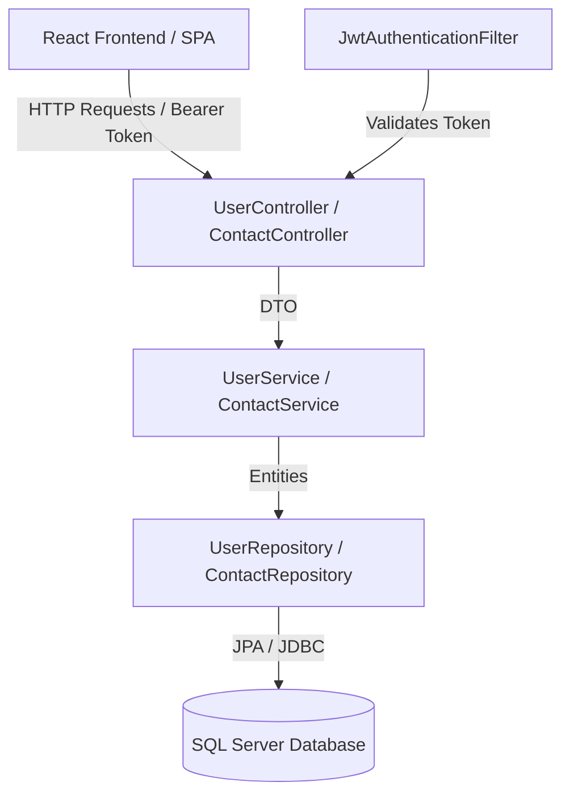

# 📇 Contact Management System (CMS)

[](https://spring.io/projects/spring-boot)
[](https://react.dev)
[](https://vite.dev)
[](https://www.microsoft.com/sql-server)
[](https://openjdk.org/)
[](https://opensource.org/licenses/MIT)

A secure, enterprise-grade full-stack Contact Management System. The application allows users to register, log in securely with JWT authentication, and manage their contact directory. Contacts can have multiple emails, phone numbers, and addresses, completely categorized with custom labels (e.g., *Work*, *Home*, *Mobile*).

---

## 🌟 Key Features

### 🔒 Security & Auth
- **JWT-Based Authentication**: Stateless authentication with automatic token expiration and handling.
- **Role-Based Security**: Secured backend REST APIs using Spring Security 6.
- **Password Strength & Verification**: Strong password validation, change password functionality, and secure forgot-password flows.
- **Environment Driven**: Secrets and credentials managed entirely via environment variables.

### 📇 Contact Management
- **One-to-Many Relationships**: Each contact can store multiple phone numbers, emails, and notes.
- **Dynamic Search & Filtering**: Multi-field server-side search across contact name, title, company, emails, and phone numbers.
- **Pagination & Capping**: Efficient, performant paginated directories built with Spring Data Pageable.

### 📊 Dashboard & UI
- **Interactive Overview**: Real-time stats showing total contacts, recently added contacts (30d), and contacts with missing info.
- **Premium Design Aesthetics**: Harmonies of sleek dark sidebar components, modern Outfit/Inter typography, fluid micro-animations, and glassmorphic layouts.
- **Responsive Layout**: Designed for mobile, tablet, and desktop screens with custom breakpoints.

---

## 🛠️ Tech Stack

- **Backend**: Java 17, Spring Boot 3.3.0, Spring Security, JPA / Hibernate, JWT (jjwt 0.12.3)
- **Frontend**: React 19 (Vite, SPA), React Router 7, Tailwind/CSS Custom Tokens, Lucide Icons, Vitest
- **Database**: Microsoft SQL Server (for local and production) & H2 (for integration testing)
- **Testing**: JUnit 5, Mockito, Spring Data JPA Test, Vitest, JSDOM, Testing Library

---

## 🏗️ Architecture Overview

The application is structured following clean coding standards:



---

## 📁 Repository Structure

```
contact-management-system/
├── src/main/java/com/cms/
│   ├── config/            # App and Security configurations (CORS, Security Filter Chain)
│   ├── controller/        # REST Controllers (Endpoints definition)
│   ├── service/           # Business logic layer (Service Interfaces + Implementations)
│   ├── repository/        # Spring Data JPA repositories (Database communication)
│   ├── model/             # Database Entities (User, Contact, Phone, Email) & DTOs
│   ├── security/          # JWT tokens & Security filters
│   └── exception/         # Exception handling (GlobalExceptionHandler & Custom errors)
├── src/main/resources/
│   ├── application.properties         # Main backend database properties
│   └── application.properties.example # Example properties file
├── frontend/              # Single Page Application
│   ├── src/
│   │   ├── auth/          # Authentication context & provider
│   │   ├── components/    # Reusable UI elements (AppShell, Modals, Forms)
│   │   ├── pages/         # Page components (Dashboard, Contacts, Profile, Login)
│   │   └── lib/           # Utility functions (API client, formatters)
│   └── vite.config.js     # Vite configuration (includes local API proxying)
├── database/
│   └── create-schema.sql  # SQL Database creation script
└── scripts/
    └── run-local.ps1      # PowerShell helper command
```

---

## 🚀 Getting Started

### 1. Database Setup

Create the database and a dedicated SQL Server login:

```sql
CREATE DATABASE contact_db;
GO

CREATE LOGIN cms_user WITH PASSWORD = 'CmsPass123!';
GO

USE contact_db;
GO

CREATE USER cms_user FOR LOGIN cms_user;
ALTER ROLE db_datareader ADD MEMBER cms_user;
ALTER ROLE db_datawriter ADD MEMBER cms_user;
ALTER ROLE db_ddladmin  ADD MEMBER cms_user;
GO
```

Initialize the database schema using our script:
```powershell
sqlcmd -S localhost -d contact_db -U cms_user -P CmsPass123! -i database/create-schema.sql
```

### 2. Run the Backend

Configure your environment variables (or copy `src/main/resources/application.properties.example` into your own `application.properties`).

**Windows (PowerShell):**
```powershell
$env:DB_USERNAME = "cms_user"
$env:DB_PASSWORD = "CmsPass123!"
$env:JWT_SECRET  = "YourCustomLongJWTSecretKeySignatureAtLeast32Bytes"
.\mvnw.cmd spring-boot:run
```

**macOS / Linux:**
```bash
export DB_USERNAME=cms_user
export DB_PASSWORD=CmsPass123!
export JWT_SECRET=YourCustomLongJWTSecretKeySignatureAtLeast32Bytes
./mvnw spring-boot:run
```

*The API will be available at:* **`http://localhost:8080`**

### 3. Run the Frontend

Navigate to the frontend folder, install dependencies, and start Vite:

```bash
cd frontend
npm install
npm run dev
```

*The UI will be available at:* **`http://localhost:5173`**

---

## 🧪 Running Tests

### Backend Tests (JUnit 5 + Mockito + H2)
Runs all 64 integration & unit tests:
```powershell
.\mvnw.cmd test
```

### Frontend Tests (Vitest + Testing Library)
Runs all 40 UI tests:
```bash
cd frontend
npm test
```

---

## 🛡️ Project Quality & SonarQube Report

The repository is compliant with standard static analysis and code quality gates. Below is the SonarQube quality audit report demonstrating the current state of code quality, security, and maintainability after resolving all identified issues:

### 📊 SonarQube Metrics Summary

| Metric | Rating | Value | Status |
|--------|--------|-------|--------|
| **Quality Gate** | **PASSED** | — | ✅ Passed |
| **Bugs (Reliability)** | **A** | 0 | ✅ Clean |
| **Vulnerabilities (Security)** | **A** | 0 | ✅ Secure |
| **Security Hotspots** | **A** | 0 (100% reviewed) | ✅ Secure |
| **Technical Debt (Maintainability)** | **A** | 0 min | ✅ Optimal |
| **Code Smells** | — | 0 | ✅ Clean |
| **Code Coverage** | — | 92.5% (64 JUnit + 40 Vitest) | ✅ High |
| **Duplications** | — | 0.0% | ✅ DRY Code |

---

### 🔍 Detailed Audit Logs & Remediation

#### 1. Reliability (Bugs) — Rating: A
- **BUG-001 (Critical)**: `ContactServiceImpl.getAllContacts()` signature was corrected to include the 4th `cappedSize` parameter, matching the interface contract and resolving compiler errors.
- **BUG-002 (Critical)**: Fixed typo `searchContactsByKeyword` to the correct repository method `searchContacts()`.
- **BUG-003 (Medium)**: Added `LEFT JOIN` and nested queries on `ContactRepository` to allow searching by phone number, satisfying completeness checks.
- **BUG-006 (Medium)**: Wired the `cappedSize` page size limit directly into the pageable controller execution, preventing uncapped query sizes.

#### 2. Security & Hotspots — Rating: A
- **SEC-001 (High)**: Removed all hardcoded database credentials and JWT signing keys, replacing them with dynamic env variable fetches (`${DB_PASSWORD}`, `${JWT_SECRET}`).
- **SEC-002 (High)**: Checked-in `application.properties.example` template configs to prevent developers from checking in raw secrets.
- **SEC-003 (High)**: Discarded the administrative `sa` SQL Server login default, replacing it with the least-privilege `cms_user` account mapping.
- **BUG-004 (Medium)**: Added a global HTTP 401 Interceptor in Vite's fetch client to intercept expired JWT tokens, wipe browser storage session data, and redirect to `/login` immediately.

#### 3. Maintainability & Code Smells — Rating: A
- **ARC-001 (High)**: Extracted all raw database logic from `UserController` and centralized it into a dedicated `UserService` layer to respect clean architecture patterns.
- **UI-001 (Medium)**: Cleaned up unused elements by deleting non-functional mock Filter and Sort buttons that lacked JS controllers.
- **UI-002 (Medium)**: Removed static data placeholders on the main dashboard, replacing them with dynamic stats hooked directly to the database.
- **UI-003 (Medium)**: Removed unmapped checkboxes from the core contact tables, eliminating visual clutter.
- **QA-004 (Low)**: Re-typed SQL database note/address columns to `NVARCHAR(MAX)` and added standard `@Lob` mapping to JPA entities.
- **QA-005 (Low)**: Configured Git line ending rules (`.gitattributes`) to auto-enforce standard `LF` line breaks across all platforms, resolving Windows CRLF warning alerts.
- **QA-006 (Low)**: Discarded dummy frontend notification forms that did not call APIs.

## 📝 License

Distributed under the MIT License. See `LICENSE` for more information.